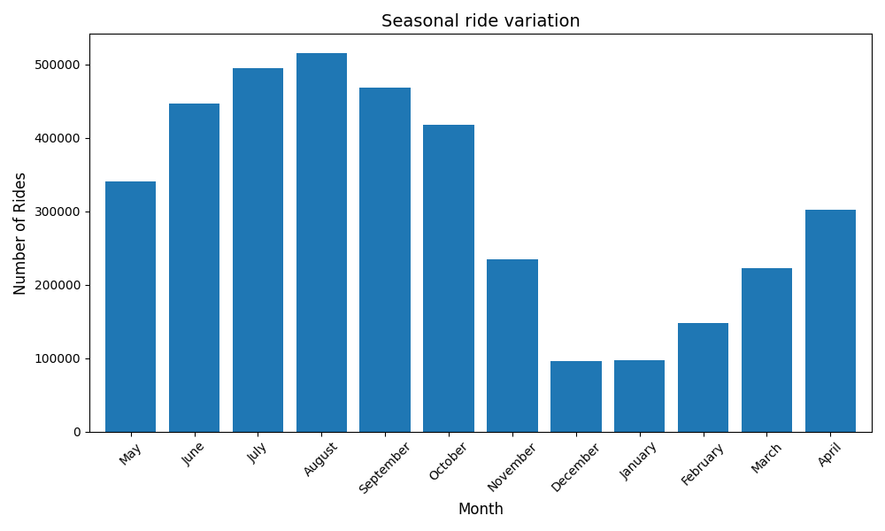
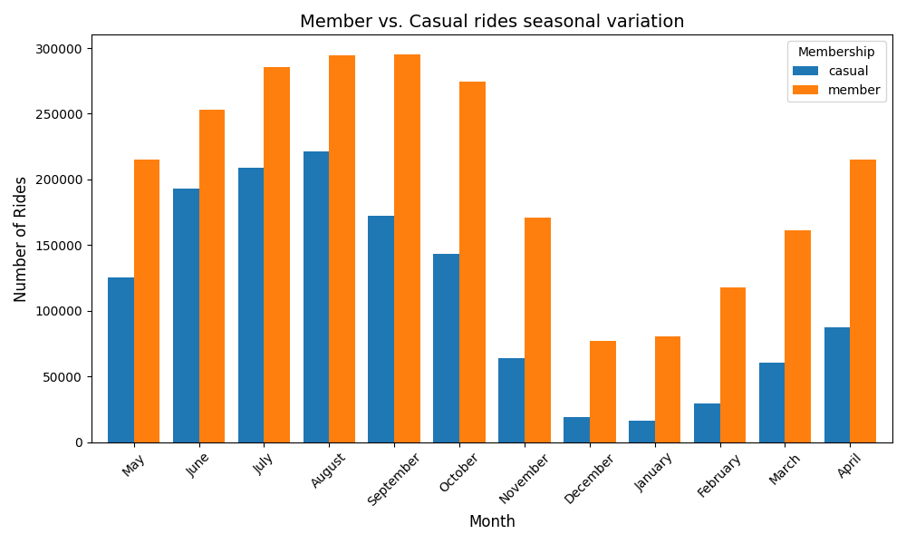
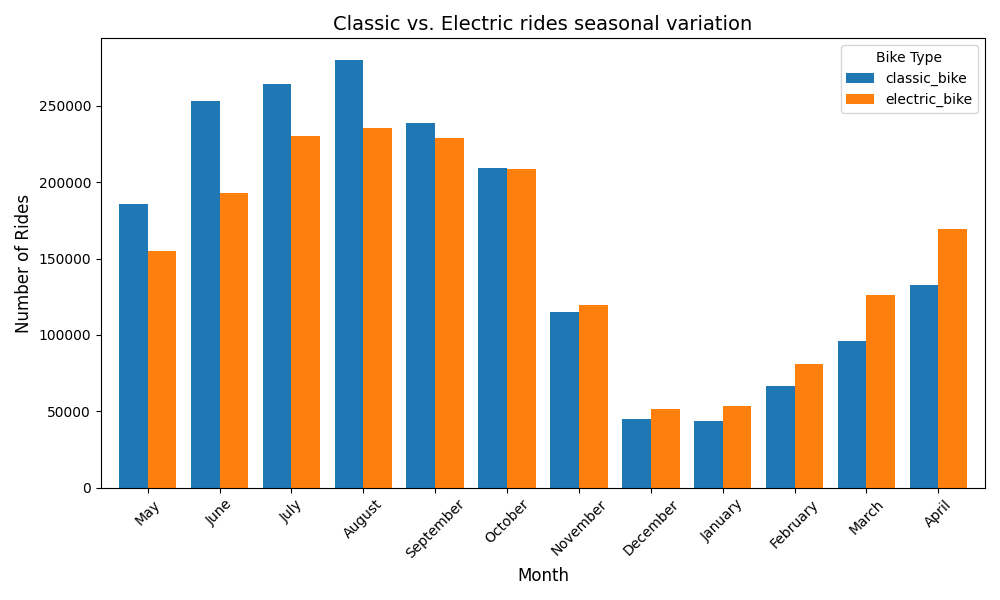
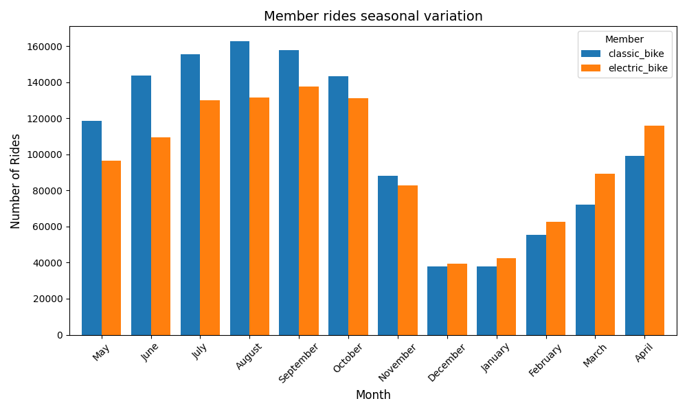
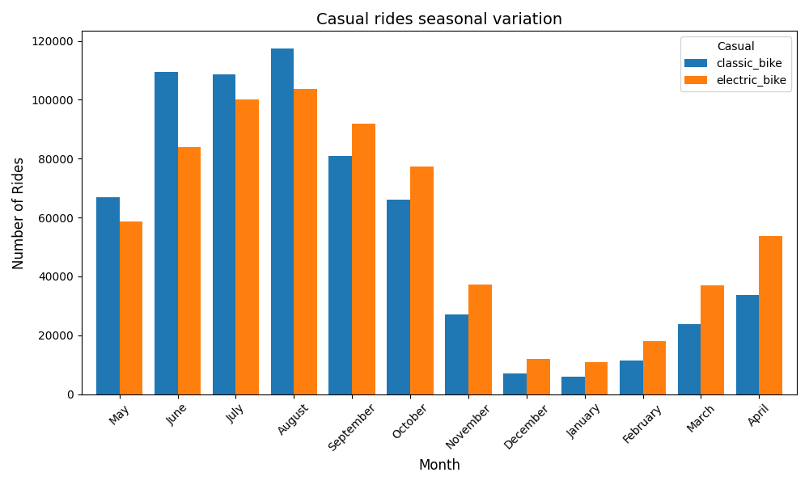
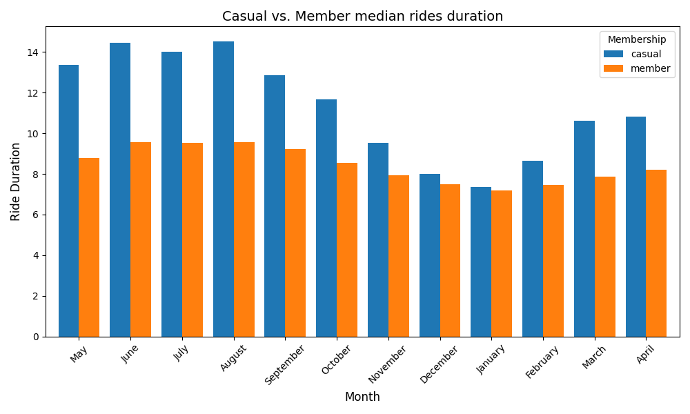
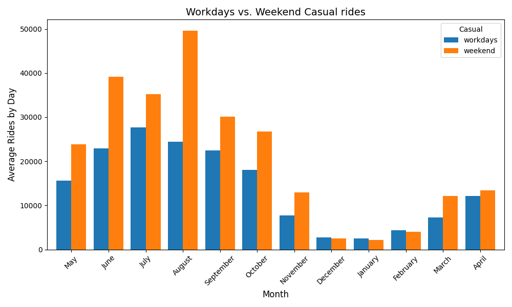
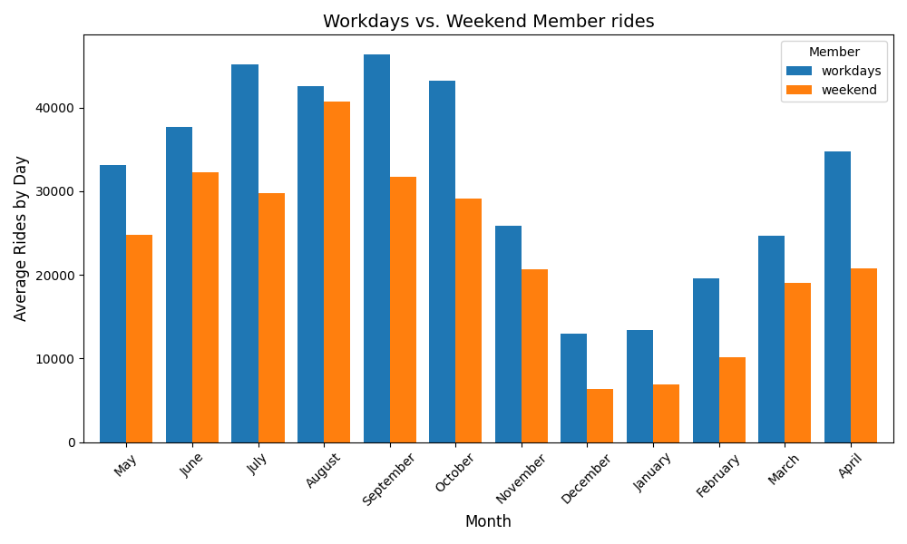

# Data Analysis on Bike Usage
_This case study served as one of the Capstone Projects for the Google Data Analytics Professional Certificate._

## Overview
The present case study is based on a fictional company (Cyclistic) and characters.
However, the data employed in the project is composed of real-world historical trips, made available by Motivate International Inc.
The provided data is bound to this [Data License Agreement](https://divvybikes.com/data-license-agreement).
Due to Privacy regulations, all data is devoid of personally identifiable information.

The main goal of this project is to simulate a case study, in which I need to collect, process, analyze data in order to provide meaningful data_driven insights and recommendations.

## Project structure
```
google_capstone/
├── scripts/       
├── plots/        
└── README.md
```

## Business Task
Lily Moreno, my manager and the director of marketing of Cyclistic, a company that employs a bike-share program, intends to desing a new marketing strategy to increase the company's subscriptions by converting casual riders into annual members. In order to convince Cyclistic's executive team to approve the recommended marketing program, it needs to be backed with compelling data insights and professional data visualizations. First and foremost, Cyclistic's marketing analytics team needs to understand how casual riders and members with annual subscription differ in their use of Cyclistic bikes. My job is to analyze data from both groups and to provide three recommendations based on the retrieved insights.

## Data Sources
It was used data corresponding to the period between May, 2025 and April, 2026.
Raw data was downloaded from [this repository](https://divvy-tripdata.s3.amazonaws.com/index.html), unziped, and kept in the 'raw_data' directory.

**Note**: 202601 csv file was initially designated as 202501. Name was corrected.

Since each dataset displayed hundreds of thousands of rows, I choose to conduct all analyses with Python through Jupyter Notebook.

I started with some exploratory analyses to assess the schema, size, data integrity and column homogeneity among data files.
The executed commands can be found in [Prepare Script](./scripts/prepare.ipynb).

### Dataset schema
| Column Name | Data Type |
| :--- | :--- |
| `ride_id` | str |
| `rideable_type` | str | 
| `started_at` | str |
| `ended_at` | str |
| `start_station_name` | str |
| `start_station_id` | str |
| `end_station_name` | str |
| `end_station_id` | str |
| `start_lat` | float64 |
| `start_lng` | float64 |
| `end_lat` | float64 |
| `end_lng` | float64 |
| `member_casual` | str |

### Dataset size
| Month | No rows |
| :--- | :--- |
| `202505` | 502456 |
| `202506` | 678904 |
| `202507` | 763432 |
| `202508` | 790177 |
| `202509` | 714759 |
| `202510` | 646039 |
| `202511` | 356628 |
| `202512` | 140534 |
| `202601` | 137787 |
| `202602` | 201450 |
| `202603` | 317037 |
| `202604` | 448252 |

### Column Homogeneity
All datasets present the same number and name of columns.

### Data integrity
The columns `ride_id`, `member_casual`, `started_at`, and `ended_at` don't present null values.
The column `ride_id` doesn't present duplicate values.
All datasets present the same unique values - `member` and `casual` - for the
`member_casual` column.

The prevalence of rows with null values was assessed for all datasets,
varying between 26.72% and 35.32%.
Considering the extensive amount of data in each dataset, I decided to
remove the rows with null data, since the number of remaining rows would
probably be enough to conduct the intended analysis.

| Month | Total rows | Rows without nulls | Rows with nulls | % nulls |
| :--- | :--- | :--- | :--- | :--- |
| `202505` | 502456 | 340634 | 161822 | 32.21 |
| `202506` | 678904 | 446363 | 232541 | 34.25 |
| `202607` | 763432 | 494293 | 269139 | 35.25 |
| `202508` | 790177 | 515533 | 274644 | 34.76 |
| `202509` | 714759 | 467881 | 246878 | 34.54 |
| `202510` | 646039 | 417877 | 228162 | 35.32 |
| `202511` | 356628 | 235010 | 121618 | 34.10 |
| `202512` | 140534 | 96158 | 96158 | 31.58 |
| `202601` | 137787 | 97118 | 97118 | 29.52 |
| `202602` | 201450 | 147622 | 53828 | 26.72 |
| `202603` | 317037 | 221900 | 95137 | 30.01 |
| `202604` | 448252 | 302413 | 145839 | 32.54 |

After removing the null values from the datasets, these were kept in the `cleaned_data/20260510-no_nulls/` directory.

Overall, the used datasets appear to be:
**Reliable**
**Original**
**Comprehensive**
**Current**
**Cited**

## Process
After preparing the datasets, I cleaned some errors and inconsistencies I found in the data.
The executed commands can be found in [Process Script](./scripts/process.ipynb).

Two new columns (`ride_duration` and `weekday`) were calculated after converting the columns `started_at` and `ended_at` to `datetime` type.

`ride_durations` with zero or negative values were checked and removed from the datasets.
Zero or negative values were only found in the `202511_no_nulls` dataset.
Copies of the datasets with zero or negative values for the `ride_duration` columns were kept in the `cleaned_data/20260510-ride_durations/` directory, while copies of the datasets with zero or negative values removed were kept in the `cleaned_data/20260510-no_negative_ride_durations/` directory.

Finally, the `started_at` and `ended_at` columns were checked for time values outside the scope of the corresponding month.
I noticed that rides that started in the final day of the previous month were registered if they ended in the first day of the corresponding month.
Rides that started in the corresponding month but lasted into the following month were registered in the following month.
The sole exception was the dataset [202604](./cleaned_data/20260510-no_negative_ride_durations/202604_no_negative_ride_durations.csv), in which the rides that started in the last day of May, 2026 and ended in the first day of June, 2026, were also registered.
For the sake of coherency, I decided to remove those entries.

The final cleaned datasets were kept in the `cleaned_data/20260510-final/` directory.

## Key Insights
After the final data cleaning process, I proceeded with the analysis to tackle the business task.
To reiterate, I need to provide insights to the marketing analytics team regarding the differences between 'member' and 'casual' riders.
The executed commands for the analysis can be found in [Analyze Script](./scripts/analyze.ipynb).

Upon inspecting and analyzing the cleaned data, I identified the folowing trends:

### Seasonal number of rides variation
Firstly, the total number of rides was assessed throught the define time period (May, 2025 - April, 2026).
The bike usage reached its peak during Summer season (July-September), while the lowest usage was registered during the Winter months (December-February).



### Seasonal number of rides variation: Member _vs._ Casual
By comparing the total number of rides between the membership and casual riders, it is possible to observe that membership riders clearly perform a higher number of trips. Both groups follow the same relative seasonal bike usage, higher during Summer months and lower during Winter months.



### Seasonal number of rides variation: Classic _vs._ Electric bikes
Interestingly, it is possible to verified a gradual shift from classic bikes to electric bikes. Until September, classic bikes were preferred, with the bike type preference shifting towards electric bikes starting from November.
With the current available data, it is not possible to infer if the bike usage shift is due to a change in the users preference or to a change in the classic/electric bike ratio made available to the public.



### Seasonal number of rides variation: Bike type preference between groups
Following the previous analysis of the classic/electric bike usage ratio, I compared the bike type preferences between casual and membership riders. Interestingly, casual riders started using more electric bike in September, 2025. On the other hand, membership riders only started to use electric bikes more often starting from December, 2025.




### Seasonal ride duration variation: Casual _vs._ Member median
While membership riders are responsible for the great majority of trips, the longest trips are attributed to casual riders. These results may be significantly impacted by casual riders that purchased the full-day pass.



### Seasonal number of rides variation: Workdays _vs._ Weekend
Finnaly, I compared the number of rides that occurred during the workdays and those that occurred during the weekend.
There is a clear distinction in the day preference between casual and membership riders.
Casual riders prefer to ride during weekends. This trend is not observable during the Winter months (December-February).
Membership riders, in average, perform more trips during the workdays.
One can suspect that membership riders use the bikes for their daily home-work/work-home trips, while casual riders use the bikes for leisure activities 



## Recommendations
* 1 - Anounce an increase in the number of electric bikes available. Casual riders showed a shift in the bike type preference 3 months earlier than membership riders. The increment in the electric bikes availability can help with the user profile transition from casual to membership.

* 2 - Offer free trials or discounts for new members on workdays. Casual riders may start to consider bikes for their daily home-work trips.

## Conclusion
This case study was a great way to apply my new data analyst skills.
While I conducted all phases of the project, this is a work in progress.
There are some perspectives in the data analysis process that I didn't conduct yet that will provide further insights.
For the next steps, I plan to analyze the differences between casual and membership riders from a geographical point of view, considering their starting and ending stations/coordinates.

## Author contact
Created by: Tito Mendes
[LinkedIn](https://www.linkedin.com/in/tito-mendes/)
